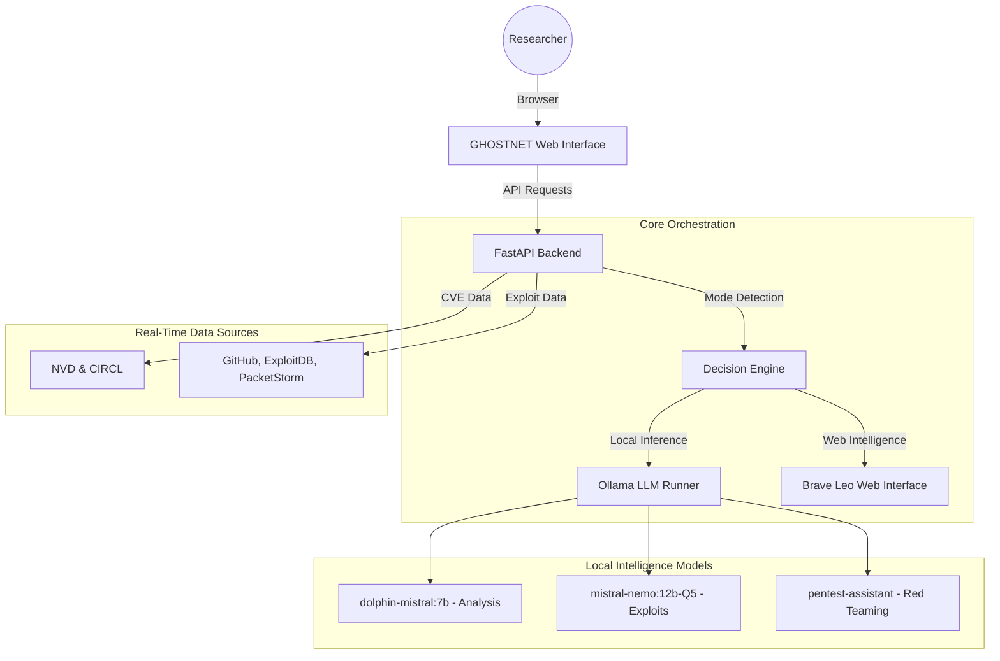

# GHOSTNET ◈ Advanced AI-Powered Security Research Platform

[](https://www.python.org/)
[](https://fastapi.tiangolo.com/)
[](https://ollama.com/)
[](https://opensource.org/licenses/MIT)

**GHOSTNET** is a high-performance, local-first platform designed for cybersecurity researchers and penetration testers. It orchestrates a suite of localized Large Language Models (LLMs) via Ollama and integrates real-time web intelligence via Brave Leo to provide a comprehensive, privacy-focused security analysis environment.

---

## 🚀 Key Features

*   **⚡ AI-Powered Security Terminal**: Context-aware prompt routing to specialized local models for exploit generation, code analysis, and offensive research.
*   **◈ Brave Leo Integration**: Seamless, one-click access to Brave's privacy-focused AI assistant for real-time web-backed security intelligence.
*   **🔍 CVE Intelligence Suite**: Aggregated live data from NVD, CIRCL, EPSS, and GitHub. Includes automated PoC discovery and exploitability scoring.
*   **🛠️ Automated Exploit & Recon**:
    *   **Exploit Gen**: Robust, multi-language exploit script generation (Python, Bash, C, Go, etc.).
    *   **Recon Planner**: Automated reconnaissance methodologies for passive and active target enumeration.
*   **🛡️ Model Auditing**: Built-in support for security-focused LLM stress testing (Garak & PromptBench hooks).

---

## 🏗️ System Architecture

GHOSTNET follows a modular, low-latency architecture designed to prioritize local execution while maintaining connectivity to essential security data sources.



---

## 🛠️ Installation & Setup

### Prerequisites

*   **Operating System**: Linux (Tested on Ubuntu/Arch), macOS, or WSL2.
*   **Hardware**: 16GB+ RAM recommended for 12b model performance.
*   **Local AI**: [Ollama](https://ollama.com/) must be installed and running.

### 1. Repository Setup

```bash
git clone https://github.com/your-username/ghostnet.git
cd ghostnet
python3 -m venv venv
source venv/bin/activate
pip install -r requirements.txt
```

### 2. Model Configuration (Ollama)

GHOSTNET is pre-configured to utilize high-performance localized models. Download the required weights using the FOLLOWING commands:

```bash
# High-Efficiency Reasoning & Coding (12b Q5)
ollama pull hf.co/dphn/dolphin-2.9.3-mistral-nemo-12b-gguf:Q5_K_M

# General Security Analysis & CVE Research
ollama pull dolphin-mistral:7b

# Specialized Red Teaming & Recon methodology
ollama pull pentest-assistant
```

### 3. Execution

```bash
uvicorn app.main:app --host 0.0.0.0 --port 8000 --reload
```
Navigate to `http://localhost:8000` in your browser.

---

## 🧩 Model Routing Logic

The platform employs a regex-based scoring system to automatically route your prompts to the most capable engine:

| Trigger Mode | Primary Model | Purpose |
| :--- | :--- | :--- |
| **Code / Exploit** | `mistral-nemo:12b` | Script writing, payload generation, bug fixing. |
| **Analysis / CVE** | `dolphin-mistral:7b` | Vulnerability assessment, Nmap parsing, CVE research. |
| **Pentest / Recon** | `pentest-assistant` | Strategy planning, enumeration tactics, CTF guidance. |
| **Brave Leo** | `Web Interface` | Real-time search, news, and verified web references. |

---

## ⚠️ Ethical & Legal Disclaimer

**FOR AUTHORIZED USE ONLY.** GHOSTNET is designed for ethical security research, penetration testing, and educational purposes. Unauthorized use of this tool for accessing or attacking systems without explicit permission is illegal and unethical. The developers assume no liability for misuse or damage caused by this platform.

---

## 📜 License

Distributed under the **MIT License**. See `LICENSE` for more information.
